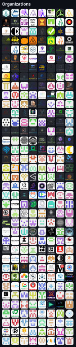

# Tom Sapletta — DevOps Engineer & Systems Architect

Hello in [OSS](https://en.wikipedia.org/wiki/Open-source_software) World!

🔭 Over 272 projects organized within a modular structure in organizations (34 rows X 8 cols)
I spent thousands of hours to give my ideas life ...
- 

## 🚀 About Me

- 💻 15+ years in DevOps, Software Development, and Systems Architecture
- 🏢 Founder & CEO at Telemonit (Portigen - edge computing power solutions)
- 🌍 Based in Germany | Open to remote collaboration
- 📚 Passionate about edge computing, hypermodularization, and automated SDLC

## 🔭 Currently Working On

+ **Portigen**: Edge computing power supply system
+ **Webstream**: Full-stack streaming application
+ **Hypermodularity**: Modular architecture frameworks
+ **Dialogware**: Text-to-software platform
  - text2doc: Documentation generation
  - text2dsl: Domain-specific language development
  - text2ops: SDLC automation

## 🛠️ Tech Stack

### Languages & Frameworks

### DevOps & Cloud

### Databases

### Monitoring & Logging

## 📊 GitHub Stats

## 🌐 Connect With Me

## 🌍 Languages

## 📈 Metrics

---

© 2025 Tom Sapletta | [tom.sapletta.com](https://tom.sapletta.com) | [tom.sapletta.pl](https://tom.sapletta.pl) | [tom.sapletta.de](https://tom.sapletta.de)
Creator of:  
- `pifunc` (multi-protocol functions)
- `mdirtree` (generate directories from Markdown)
- `markdown2code` (docs to codebases)
- `dynapsys` (dynamic deployment)
- `uripoint`, `dialogstream`, `biocomp`, and more.

---

## Experience (Recent)

- **Telemonit, Founder & CEO** (2024–): Leading Portigen development.
- **Link11 GmbH, DevOps Engineer** (2023–2024): CDN/DNS security & performance.
- **IT-NRW, Java Dev & DevOps** (2020–2023): Integration platforms for public services.

---

## Research Interests

- Automated code generation (TextToSoftware)
- Hypermodularization
- Edge computing & distributed systems
- MBSE, Component-Based Development, Digital Twins

---

## Collaboration

Open to partnering on edge computing, modularization, text-to-software, and open-source tech—especially projects connecting research and industry or education.

---

## Contact & Links

- **ORCID:** 0009-0000-6327-2810
- **GitHub:** [tom-sapletta-com](https://github.com/tom-sapletta-com)
- **PyPI:** [Python Packages](https://pypi.org/user/tom-sapletta-com)
- **LinkedIn:** [Tom Sapletta](https://linkedin.com/in/tom-sapletta-com)
- **Blogs:** [EN](https://tom.sapletta.com) | [DE](https://tom.sapletta.de) | [PL](https://tom.sapletta.pl)

---

## Services

- **Infrastructure:** DevOps, Cloud, Architecture
- **Software:** Python, Java, JavaScript, PHP
- **Hardware:** IoT, Embedded, Mobile servers

---

## Notable Python Projects

- **pifunc:** Protocol-agnostic network functions
- **mdirtree:** Directory generation from Markdown
- **markdown2code:** Docs to codebases
- **dynapsys:** Dynamic deployment
- **uripoint, dialogstream, biocomp, browseek, vocochat, salomos, dobyemail, codialog, pyfunc-config, pyfunc2, dialoget** — see PyPI for more

---

## Internet Projects & Domains

- **AskDomainer:** Domain consultation
- **TextToSoftware Projects:** [www.to.software](https://www.to.software), [text.to.software](https://text.to.software), [click.to.software](https://click.to.software), [dsl.to.software](https://dsl.to.software)
- **Company:** Softreck (Estonia), Telemonit (Germany)

---

 2025 Tom Sapletta — digitname.com

---
