... Hello in [OSS](https://en.wikipedia.org/wiki/Open-source_software) World!

I'm Tom, DevOps focused on PHP, JAVA, JavaScript/NodeJS/Deno, Python, Bash, ...

🔭 I’m currently working on Softreck Projects and I am sharing here my ideas in areas: 

+ frontend & backend application streaming (webstream)
+ hypermodularity, functional thinking, apidsl
+ wetware, devops, domains


#text2software
+ #text2doc - specifications, documentations, tutorials
+ #text2dsl - software development
+ #text2ops - operations, SDLC


<code>🔭 [Researcher](https://linkedin.com/in/tom-sapletta-com)</code>
<code>👷  [by Github followers](https://github.com/search?q=location%3AEstonia)</code>

I spent thousands of hours to give my ideas life, but it's still not perfect.

Feel free to use my source code from hundreds of repos/projects/organisations.

Don't hesitate to improve the code and use it to your own projects!

[](https://github.com/tom-sapletta-com)

 

### :star: 2022


```json
Tom Sapletta {
  "tags":     ["Domains", "DevOps", "Wetware", "Modularity", "5G", "6G"],  
  "countries":  ["Germany"],
  "languages": ["JAVA", "Python", "PHP", "JS", "NodeJS", "..."],
  "interests": ["Clean Code", "Clean Architecture", "Static Code Analysis", "Linux", "IoT"]
}
```


[Metrics sponsors](metrics.personal.sponsors.svg)


- Blog: [tom.sapletta.com](https://tom.sapletta.com/)
- LinkedIn: [sapletta](https://www.linkedin.com/in/tom-sapletta-com/)
- XING: [sapletta](https://www.xing.com/profile/Tomasz_Sapletta)


Follow me on LinkedIn: www.linkedin.com/comm/mynetwork/discovery-see-all?usecase=PEOPLE_FOLLOWS&followMember=tom-sapletta-com
